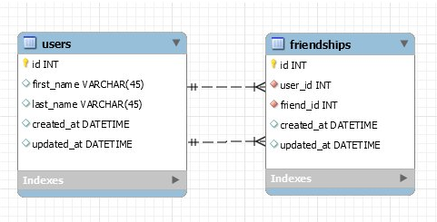

# Assignment: Friendships

## ERD



---

## Tables

### `users`

| Column     | Type                  |
| ---------- | --------------------- |
| id         | INT PK AUTO_INCREMENT |
| first_name | VARCHAR(45)           |
| last_name  | VARCHAR(45)           |
| created_at | DATETIME              |
| updated_at | DATETIME              |

### `friendships`

| Column     | Type                  | Notes                     |
| ---------- | --------------------- | ------------------------- |
| id         | INT PK AUTO_INCREMENT |                           |
| user_id    | INT FK                | → users.id (the user)     |
| friend_id  | INT FK                | → users.id (their friend) |
| created_at | DATETIME              |                           |
| updated_at | DATETIME              |                           |

---

## Users Created

| ID  | first_name | last_name |
| --- | ---------- | --------- |
| 1   | Amy        | Giver     |
| 2   | Eli        | Byers     |
| 3   | Marky      | Mark      |
| 4   | Big        | Bird      |
| 5   | Kermit     | The Frog  |
| 6   | Cookie     | Monster   |

---

## Queries

---

### Create the database and tables

```sql
CREATE DATABASE IF NOT EXISTS friendships_db;
USE friendships_db;

CREATE TABLE IF NOT EXISTS users (
    id         INT         NOT NULL AUTO_INCREMENT,
    first_name VARCHAR(45) NOT NULL,
    last_name  VARCHAR(45) NOT NULL,
    created_at DATETIME    DEFAULT NOW(),
    updated_at DATETIME    DEFAULT NOW(),
    PRIMARY KEY (id)
);

CREATE TABLE IF NOT EXISTS friendships (
    id         INT NOT NULL AUTO_INCREMENT,
    user_id    INT NOT NULL,
    friend_id  INT NOT NULL,
    created_at DATETIME DEFAULT NOW(),
    updated_at DATETIME DEFAULT NOW(),
    PRIMARY KEY (id),
    FOREIGN KEY (user_id)   REFERENCES users(id),
    FOREIGN KEY (friend_id) REFERENCES users(id)
);
```

---

### Query: Create 6 new users

```sql
INSERT INTO users (first_name, last_name) VALUES
    ('Amy',    'Giver'),
    ('Eli',    'Byers'),
    ('Marky',  'Mark'),
    ('Big',    'Bird'),
    ('Kermit', 'The Frog'),
    ('Cookie', 'Monster');
```

---

### Query: Have user 1 be friends with users 2, 4, and 6

```sql
INSERT INTO friendships (user_id, friend_id) VALUES (1, 2), (1, 4), (1, 6);
```

---

### Query: Have user 2 be friends with users 1, 3, and 5

```sql
INSERT INTO friendships (user_id, friend_id) VALUES (2, 1), (2, 3), (2, 5);
```

---

### Query: Have user 3 be friends with users 2 and 5

```sql
INSERT INTO friendships (user_id, friend_id) VALUES (3, 2), (3, 5);
```

---

### Query: Have user 4 be friends with user 3

```sql
INSERT INTO friendships (user_id, friend_id) VALUES (4, 3);
```

---

### Query: Have user 5 be friends with users 1 and 6

```sql
INSERT INTO friendships (user_id, friend_id) VALUES (5, 1), (5, 6);
```

---

### Query: Have user 6 be friends with users 2 and 3

```sql
INSERT INTO friendships (user_id, friend_id) VALUES (6, 2), (6, 3);
```

---

### Query: Display all relationships (self join)

```sql
SELECT
    users.first_name,
    users.last_name,
    user2.first_name AS friend_first_name,
    user2.last_name  AS friend_last_name
FROM users
JOIN friendships ON users.id = friendships.user_id
LEFT JOIN users AS user2 ON friendships.friend_id = user2.id;
```

**Expected result:**

| first_name | last_name | friend_first_name | friend_last_name |
| ---------- | --------- | ----------------- | ---------------- |
| Amy        | Giver     | Eli               | Byers            |
| Amy        | Giver     | Big               | Bird             |
| Amy        | Giver     | Cookie            | Monster          |
| Eli        | Byers     | Amy               | Giver            |
| Eli        | Byers     | Marky             | Mark             |
| Eli        | Byers     | Kermit            | The Frog         |
| Marky      | Mark      | Eli               | Byers            |
| Marky      | Mark      | Kermit            | The Frog         |
| Big        | Bird      | Marky             | Mark             |
| Kermit     | The Frog  | Amy               | Giver            |
| Kermit     | The Frog  | Cookie            | Monster          |
| Cookie     | Monster   | Eli               | Byers            |
| Cookie     | Monster   | Marky             | Mark             |

**How the self join works:**

The `friendships` table has two foreign keys both pointing to `users`. To get both names in one row, we join `users` to itself twice — the second copy is aliased as `user2`:

```
users.id = friendships.user_id         → gets the user's own name
friendships.friend_id = user2.id       → gets the friend's name
```

---

### NINJA Query: Return all users who are friends with user 1

```sql
SELECT user2.first_name, user2.last_name
FROM friendships
LEFT JOIN users AS user2 ON friendships.friend_id = user2.id
WHERE friendships.user_id = 1;
```

---

### NINJA Query: Return the count of all friendships

```sql
SELECT COUNT(*) AS total_friendships
FROM friendships;
```

---

### NINJA Query: Find who has the most friends and return their friend count

```sql
SELECT users.first_name, users.last_name, COUNT(friendships.id) AS friend_count
FROM users
JOIN friendships ON users.id = friendships.user_id
GROUP BY users.id
ORDER BY friend_count DESC
LIMIT 1;
```

`GROUP BY` groups all rows per user → `COUNT()` counts their friends → `ORDER BY DESC LIMIT 1` returns only the top result.

---

### NINJA Query: Return the friends of user 3 in alphabetical order

```sql
SELECT user2.first_name, user2.last_name
FROM friendships
LEFT JOIN users AS user2 ON friendships.friend_id = user2.id
WHERE friendships.user_id = 3
ORDER BY user2.first_name ASC;
```

---

## The Self Join — Key Concept

A self join means joining a table to itself. We need this because the `friendships` table has two user IDs in the same row, and we want both people's names.

```sql
FROM users                                              -- user's own name
JOIN friendships ON users.id = friendships.user_id     -- connect to their friendship row
LEFT JOIN users AS user2 ON friendships.friend_id = user2.id  -- get the friend's name
```

Without the alias `user2`, SQL would not know which copy of `users` you're referring to when you write `users.first_name`.

---

## Friendship Map

```
Amy    ──→ Eli, Big, Cookie
Eli    ──→ Amy, Marky, Kermit
Marky  ──→ Eli, Kermit
Big    ──→ Marky
Kermit ──→ Amy, Cookie
Cookie ──→ Eli, Marky
```

---
