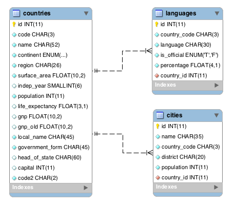

# MySQL Countries — World Database Queries

## ERD Diagram



---

## Setup

Download the world database SQL file and import it into MySQL Workbench:

```sql
-- Run this first in MySQL Workbench
USE world;
```

Or run the full SQL file by opening it in MySQL Workbench and clicking **Run** (⚡).

---

## Tables

| Table       | Key Columns                                                                                                                |
| ----------- | -------------------------------------------------------------------------------------------------------------------------- |
| `countries` | `id`, `code`, `name`, `continent`, `region`, `surface_area`, `population`, `life_expectancy`, `government_form`, `capital` |
| `cities`    | `id`, `name`, `country_code`, `district`, `population`, `country_id`                                                       |
| `languages` | `id`, `country_code`, `language`, `is_official`, `percentage`                                                              |

---

## Queries

### 1. Countries that speak Slovene

```sql
SELECT
    countries.name,
    languages.language,
    languages.percentage
FROM countries
JOIN languages ON countries.code = languages.country_code
WHERE languages.language = 'Slovene'
ORDER BY languages.percentage DESC;
```

**What it does:** Joins countries to languages, filters by the language name, sorts highest percentage first.

---

### 2. Total number of cities per country

```sql
SELECT
    countries.name,
    COUNT(cities.id) AS total_cities
FROM countries
JOIN cities ON countries.id = cities.country_id
GROUP BY countries.name
ORDER BY total_cities DESC;
```

**What it does:** Groups cities by country and counts how many each country has.

---

### 3. Cities in Mexico with population > 500,000

```sql
SELECT
    cities.name,
    cities.population
FROM cities
JOIN countries ON cities.country_id = countries.id
WHERE countries.name = 'Mexico'
  AND cities.population > 500000
ORDER BY cities.population DESC;
```

---

### 4. Languages with percentage > 89%

```sql
SELECT
    countries.name,
    languages.language,
    languages.percentage
FROM countries
JOIN languages ON countries.code = languages.country_code
WHERE languages.percentage > 89
ORDER BY languages.percentage DESC;
```

---

### 5. Countries with surface area < 501 and population > 100,000

```sql
SELECT
    name,
    surface_area,
    population
FROM countries
WHERE surface_area < 501
  AND population > 100000;
```

**What it does:** No JOIN needed — all the data is in the `countries` table. Both conditions must be true (`AND`).

---

### 6. Constitutional Monarchies with capital > 200 and life expectancy > 75

```sql
SELECT
    name,
    government_form,
    capital,
    life_expectancy
FROM countries
WHERE government_form = 'Constitutional Monarchy'
  AND capital > 200
  AND life_expectancy > 75;
```

> **Note:** `capital` in the countries table is the city ID of the capital, not a name — so `capital > 200` filters by city ID number, not by population or alphabetical order.

---

### 7. Argentina cities in Buenos Aires district with population > 500,000

```sql
SELECT
    countries.name  AS country_name,
    cities.name     AS city_name,
    cities.district,
    cities.population
FROM cities
JOIN countries ON cities.country_id = countries.id
WHERE countries.name = 'Argentina'
  AND cities.district = 'Buenos Aires'
  AND cities.population > 500000;
```

---

### 8. Number of countries per region

```sql
SELECT
    region,
    COUNT(*) AS num_countries
FROM countries
GROUP BY region
ORDER BY num_countries DESC;
```

**What it does:** Groups all countries by their region and counts how many fall in each one.

---

## Key SQL Concepts Used

| Concept                                  | Where Used            |
| ---------------------------------------- | --------------------- |
| `JOIN`                                   | Queries 1, 2, 3, 4, 7 |
| `WHERE` with multiple conditions (`AND`) | Queries 3, 4, 5, 6, 7 |
| `GROUP BY` + `COUNT()`                   | Queries 2, 8          |
| `ORDER BY ... DESC`                      | All queries           |
| Aliases (`AS`)                           | Queries 2, 7, 8       |

---
