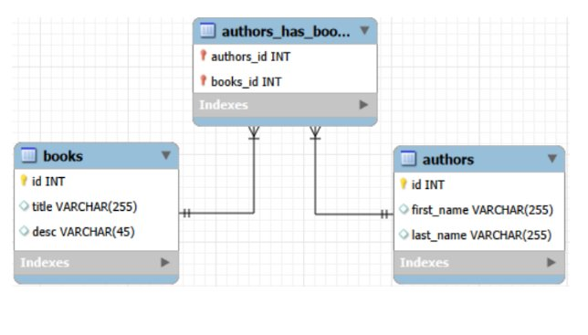

# Assignment: Books/Authors (Django Shell)

## ERD



---

## Project Setup

```bash
django-admin startproject books_authors_proj
cd books_authors_proj
python manage.py startapp books_authors_app
```

Add `'books_authors_app'` to `INSTALLED_APPS` in `settings.py`.

---

## Models (`books_authors_app/models.py`)

```python
from django.db import models

class Book(models.Model):
    title = models.CharField(max_length=255)
    desc  = models.CharField(max_length=45)
    created_at = models.DateTimeField(auto_now_add=True)
    updated_at = models.DateTimeField(auto_now=True)

    def __str__(self):
        return self.title


class Author(models.Model):
    first_name = models.CharField(max_length=255)
    last_name  = models.CharField(max_length=255)
    books      = models.ManyToManyField(Book, related_name='authors')
    created_at = models.DateTimeField(auto_now_add=True)
    updated_at = models.DateTimeField(auto_now=True)

    def __str__(self):
        return f"{self.first_name} {self.last_name}"
```

Run migrations:

```bash
python manage.py makemigrations
python manage.py migrate
```

---

## Add `notes` field to Author

Add this inside the `Author` class:

```python
notes = models.TextField(blank=True)
```

Then run:

```bash
python manage.py makemigrations
python manage.py migrate
```

---

## Shell Queries

Open the Django shell and import your models:

```bash
python manage.py shell
```

```python
from books_authors_app.models import Book, Author
```

---

### Query: Create 5 books with the following names: C Sharp, Java, Python, PHP, Ruby

```python
Book.objects.create(title='C Sharp', desc='')
Book.objects.create(title='Java', desc='')
Book.objects.create(title='Python', desc='')
Book.objects.create(title='PHP', desc='')
Book.objects.create(title='Ruby', desc='')
```

---

### Query: Create 5 different authors: Jane Austen, Emily Dickinson, Fyodor Dostoevsky, William Shakespeare, Lau Tzu

```python
Author.objects.create(first_name='Jane', last_name='Austen')
Author.objects.create(first_name='Emily', last_name='Dickinson')
Author.objects.create(first_name='Fyodor', last_name='Dostoevsky')
Author.objects.create(first_name='William', last_name='Shakespeare')
Author.objects.create(first_name='Lau', last_name='Tzu')
```

---

### Query: Change the name of the C Sharp book to C#

```python
book = Book.objects.get(id=1)
book.title = 'C#'
book.save()
```

---

### Query: Change the first name of the 4th author to Bill

```python
author = Author.objects.get(id=4)
author.first_name = 'Bill'
author.save()
```

---

### Query: Assign the first author to the first 2 books

```python
author1 = Author.objects.get(id=1)
author1.books.add(Book.objects.get(id=1))
author1.books.add(Book.objects.get(id=2))
```

---

### Query: Assign the second author to the first 3 books

```python
author2 = Author.objects.get(id=2)
author2.books.add(Book.objects.get(id=1))
author2.books.add(Book.objects.get(id=2))
author2.books.add(Book.objects.get(id=3))
```

---

### Query: Assign the third author to the first 4 books

```python
author3 = Author.objects.get(id=3)
author3.books.add(Book.objects.get(id=1))
author3.books.add(Book.objects.get(id=2))
author3.books.add(Book.objects.get(id=3))
author3.books.add(Book.objects.get(id=4))
```

---

### Query: Assign the fourth author to all 5 books

```python
author4 = Author.objects.get(id=4)
author4.books.set(Book.objects.all())
```

`.set()` replaces all existing relationships at once — easier than calling `.add()` five times.

---

### Query: Retrieve all the authors for the 3rd book

```python
book3 = Book.objects.get(id=3)
book3.authors.all()
```

`book3.authors` works because we defined `related_name='authors'` on the ManyToManyField.

---

### Query: Remove the first author from the 3rd book

```python
book3 = Book.objects.get(id=3)
book3.authors.remove(Author.objects.get(id=1))
```

---

### Query: Add the 5th author as one of the authors of the 2nd book

```python
book2 = Book.objects.get(id=2)
book2.authors.add(Author.objects.get(id=5))
```

---

### Query: Find all the books that the 3rd author is part of

```python
author3 = Author.objects.get(id=3)
author3.books.all()
```

---

### Query: Find all the authors that contributed to the 5th book

```python
book5 = Book.objects.get(id=5)
book5.authors.all()
```

---

## Many-to-Many Cheat Sheet

| Action                   | Command           |
| ------------------------ | ----------------- |
| Add one relationship     | `.add(object)`    |
| Add multiple at once     | `.set(queryset)`  |
| Remove a relationship    | `.remove(object)` |
| Remove all relationships | `.clear()`        |
| Get all related objects  | `.all()`          |

---

## How the Many-to-Many Works

The `authors_has_books` table in the ERD is created automatically by Django when you define a `ManyToManyField`. You don't create it yourself — Django handles it behind the scenes.

```
Book ←──── authors_has_books ────→ Author
            authors_id (FK)
            books_id   (FK)
```

You navigate it from either side:

- `author.books.all()` → all books this author has
- `book.authors.all()` → all authors of this book

---

## How to Run

```bash
python manage.py shell
```
